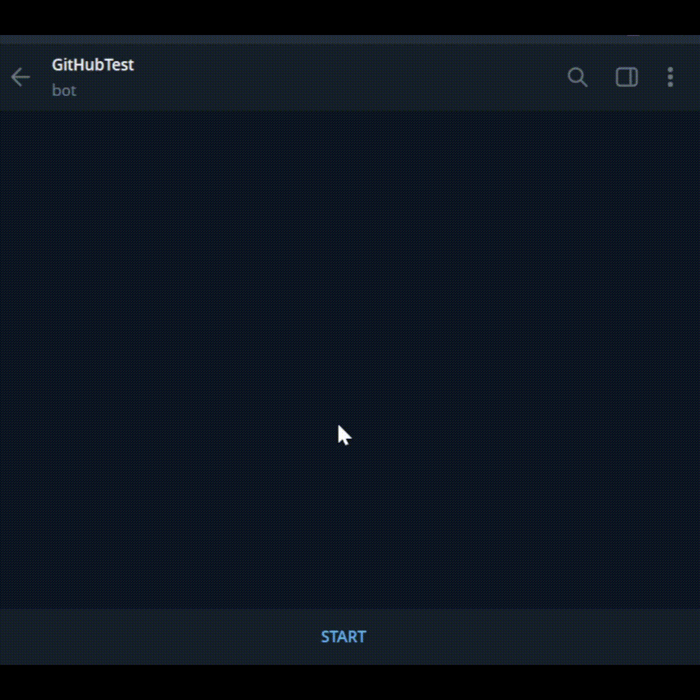

# CryptoBot

A simple Telegram bot that shows real-time cryptocurrency prices using the Binance API.

The bot displays a list of popular coins, allows users to select a coin via inline buttons, and fetches the current USDT price with basic caching to reduce API requests.

This project is created **purely for my personal portfolio**.  
It does not represent a production-ready or commercial solution and will be updated over time.

---

## Features

- Inline keyboard with popular cryptocurrencies
- Real-time prices from Binance
- Simple price formatting logic
- Lightweight in-memory cache
- Built with `aiogram 3.x`
- Async & fast

---

## Demo

---

## Available Coins

- Bitcoin (BTC)
- Ethereum (ETH)
- Solana (SOL)
- Toncoin (TON)
- BNB (BNB)
- Dogecoin (DOGE)
- Ripple (XRP)
- Cardano (ADA)

---
